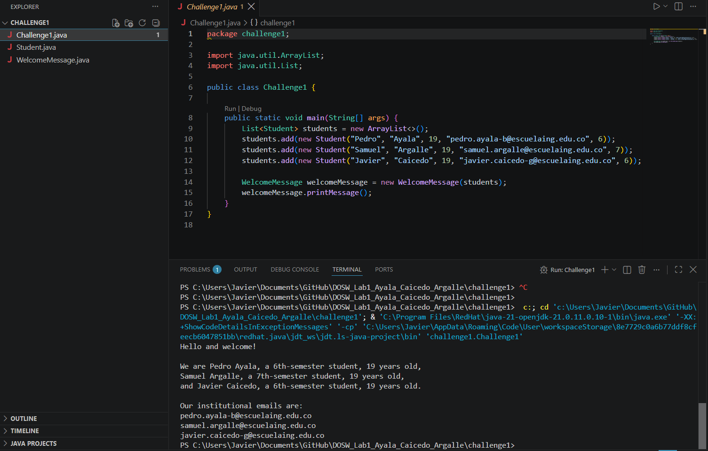
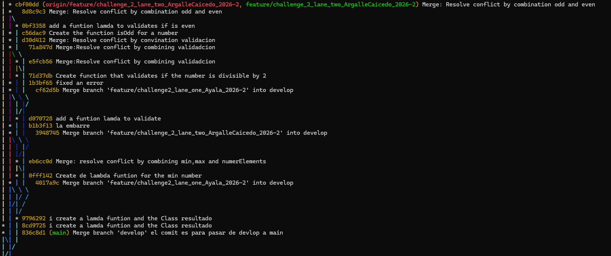
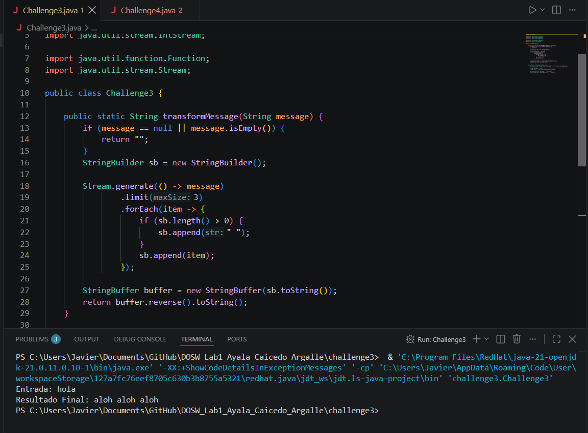
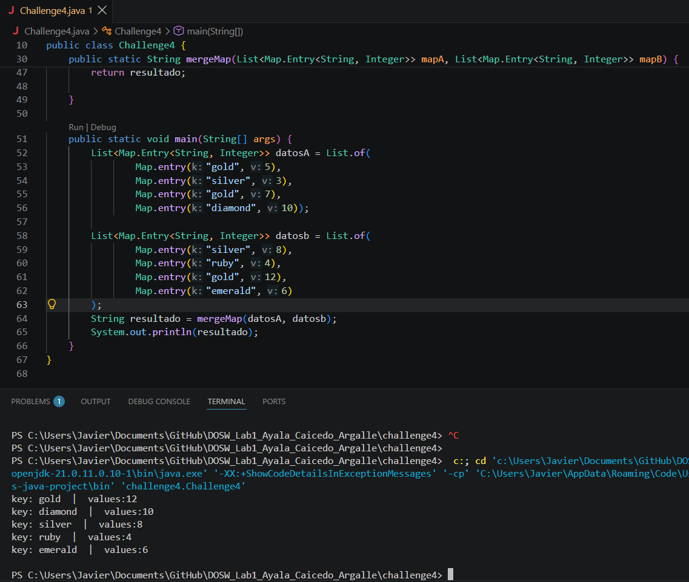
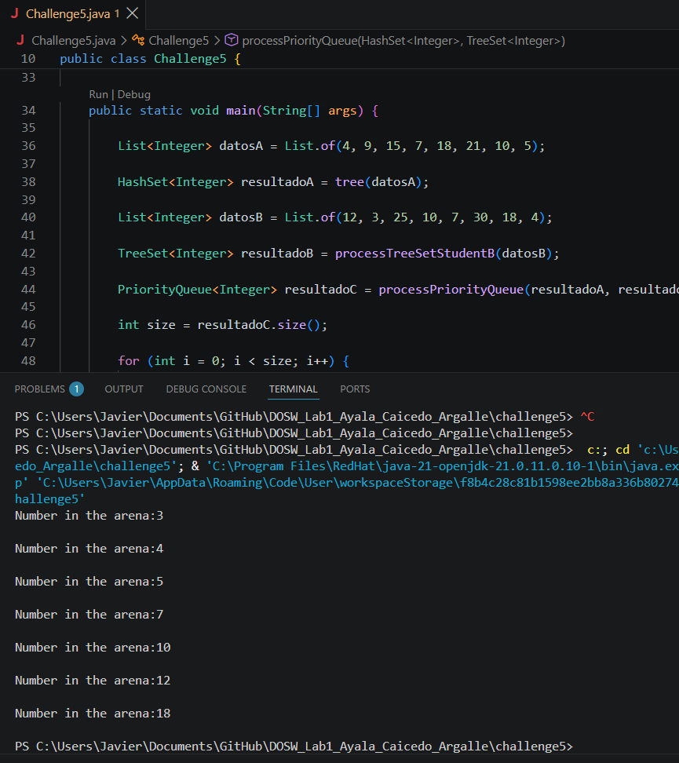
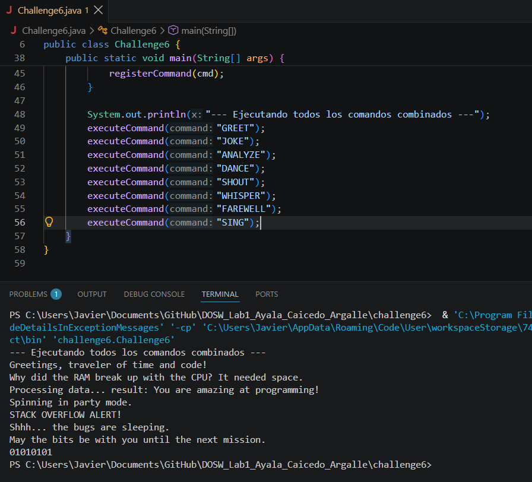

# DOSW Laboratory 1 - Solutions

## Team Members
- Pedro Ayala
- Samuel Argalle
- Javier Caicedo

---

## Challenge 1 – Team Introduction & Welcome Message

### Evidence

### Description

Briefly explain:

- **What was implemented:** A Java program with a `Student` class and a `WelcomeMessage` class. We used Java Streams and Lambdas (`stream()`, `map()`, `collect()`) to build a formatted welcome message with student details and emails.
- **How the work was divided:** Pedro wrote the `Student` class, Samuel wrote the stream logic in `WelcomeMessage`, and Javier made the `Challenge1.java` main class.
- **Which Git operations were used:** `git checkout -b feature/challenge1`, `git add`, `git commit`, `git push`, and `git merge main`.
- **Which conflicts appeared:** Conflicts happened in `WelcomeMessage.java` when merging different string formatting edits.
- **How the conflicts were resolved:** We opened `WelcomeMessage.java`, fixed the conflict markers manually, and committed the working file.

## Challenge 2 – Parallel Race & Number Statistics

### Evidence

### Description

Briefly explain:

- **What was implemented:** A tool using `Function` lambdas to find the min, max, and count of a list of numbers, and check if numbers are even, odd, divisible, or multiples of 2. Results are saved in a `Resultado` object.
- **How the work was divided:** Samuel made the min/max/count lambda, Javier wrote the validation lambdas (`isDivisible`, `isMultiple`, `isOdd`, `isEven`), and Pedro created `Resultado.java` and `miFuncion`.
- **Which Git operations were used:** `git checkout -b feature/challenge2`, `git commit`, `git pull origin main`, and `git merge`.
- **Which conflicts appeared:** A conflict appeared in `ParallelRace.java` because we changed function names at the same time.
- **How the conflicts were resolved:** We kept all validation functions, renamed them clearly, and committed the merge.

## Challenge 3 – Message Transformation & Stream Operations

### Evidence

### Description

Briefly explain:

- **What was implemented:** A `transformMessage` method using `Stream.generate()`, `.limit(3)`, `StringBuilder`, and `StringBuffer.reverse()` to repeat a message 3 times and reverse the whole text.
- **How the work was divided:** Javier wrote the `Stream.generate` part, Pedro wrote the `StringBuffer.reverse()` part, and Samuel connected everything in `Challenge3.java`.
- **Which Git operations were used:** `git branch feature/challenge3`, `git checkout`, `git add`, `git commit`, and `git merge`.
- **Which conflicts appeared:** Conflict with duplicated import lines and method signatures in `Challenge3.java`.
- **How the conflicts were resolved:** Removed duplicated imports, kept one clean method, and tested the output.

## Challenge 4 – Map Sorting & Merging

### Evidence

### Description

Briefly explain:

- **What was implemented:** Sorted key-value pairs into `HashMap` and `Hashtable` using streams. Created `mergeMap()` to join data from Student A and Student B into a single formatted string.
- **How the work was divided:** Pedro built `mapsStudentA` with `HashMap`, Samuel built `mapsStudentB` with `Hashtable`, and Javier wrote `mergeMap()`.
- **Which Git operations were used:** `git checkout -b feature/challenge4`, `git commit`, `git rebase main`, and `git push origin main`.
- **Which conflicts appeared:** A conflict in `mergeMap()` when deciding how to handle duplicate keys between `HashMap` and `Hashtable`.
- **How the conflicts were resolved:** Used `containsKey` checks to make sure no keys were overwritten or lost.

## Challenge 5 – Collections Filtering & Priority Queue Arena

### Evidence

### Description

Briefly explain:

- **What was implemented:** Filtered numbers into different collections: multiples of 3 into a `HashSet`, multiples of 5 into a `TreeSet`, and combined both into a `PriorityQueue` to print them in order.
- **How the work was divided:** Samuel wrote the `HashSet` filter (`tree`), Javier wrote the `TreeSet` filter (`processTreeSetStudentB`), and Pedro made `processPriorityQueue` and the main loop.
- **Which Git operations were used:** `git checkout -b feature/challenge5`, `git add .`, `git commit`, `git push`, and `git merge`.
- **Which conflicts appeared:** Conflicts in `main()` because we had different sample lists in different branches.
- **How the conflicts were resolved:** Combined `datosA` and `datosB` into the main method and verified the output order.

## Challenge 6 – Command Pattern & Action Dispatcher

### Evidence

### Description

Briefly explain:

- **What was implemented:** A command handler using `HashMap<String, Runnable>`. Created `registerCommand()` to map commands like `JOKE`, `SHOUT`, `GREET` to lambdas, and `executeCommand()` to run them.
- **How the work was divided:** Pedro created the command map and switch structure, Samuel added more command lambdas, and Javier wrote `executeCommand` and the main test run.
- **Which Git operations were used:** `git checkout -b feature/challenge6`, `git commit`, `git pull`, and `git merge feature/challenge6`.
- **Which conflicts appeared:** Conflict in the `switch` statement when adding commands simultaneously.
- **How the conflicts were resolved:** Merged all cases into one single `switch` block and tested every command.

---

## Lab Questions & Answers

1. **Team agreements: Add the agreements you defined in the Onboarding section here.**
   - Create a branch for each challenge (e.g. `feature/challenge1`).
   - Divide work equally between team members.
   - Test our code before merging to main.
   - Solve conflicts together when merging.

2. **What is the difference between `git merge` and `git rebase`?**
   - `git merge` joins two branches by creating a new merge commit, keeping the history as it happened.
   - `git rebase` moves your commits to the top of another branch to make the commit history look like a straight line.

3. **What happens when two branches modify the same line of a file?**
   - Git creates a merge conflict because it doesn't know which line to keep. It adds conflict markers (`<<<<<<<`, `=======`, `>>>>>>>`) in the file, and we have to edit the file manually to fix it.

4. **How can you display the branch and merge history graphically in the terminal?**
   - Using the command: `git log --oneline --graph --decorate --all`

5. **What is the difference between a commit and a push?**
   - A `commit` saves changes locally on your computer.
   - A `push` uploads those saved changes from your computer to GitHub.

6. **What are `git stash` and `git stash pop` used for?**
   - `git stash` temporarily hides your uncommitted changes so you can work on a clean workspace.
   - `git stash pop` brings back those hidden changes to your workspace.

7. **What is the difference between `HashMap` and `Hashtable`?**
   - `HashMap` allows `null` keys and values and is not synchronized (faster).
   - `Hashtable` does not allow `null` keys or values and is synchronized (slower, but safer for threads).

8. **What advantages does `Collectors.toMap()` provide over a traditional loop?**
   - It lets us convert a stream directly into a Map in a single line, making the code shorter and easier to read without writing a `for` loop.

9. **When using `stream().map()` on a list of objects, what type of operation is being performed?**
   - It is an intermediate operation that transforms each item in the stream into something else (like getting student names from student objects).

10. **What does `stream().filter()` do, and what does it return?**
    - It checks each item using a condition, keeps only the items that meet the condition, and returns a new Stream with those items.

11. **Describe the steps required to create a new feature branch from `develop`.**
    - Go to develop branch: `git checkout develop`
    - Get latest changes: `git pull origin develop`
    - Create and switch to new branch: `git checkout -b feature/challenge-name`

12. **What is the difference between `git branch` and `git checkout -b`?**
    - `git branch <name>` only creates a new branch, but you stay on the current branch.
    - `git checkout -b <name>` creates the new branch and switches to it immediately.

13. **Why should new functionality be developed in `feature/*` branches instead of directly in `main`?**
    - Because it keeps the `main` branch clean and working while we build new features. If something breaks in a feature branch, it won't break the main project.

---

## AI Declaration

- **Tools Used:** Gemini and Claude
- **Purpose:** Used for code debugging, fixing errors, and refining documentation structure.
- **Authorship:** All core implementations and Git workflow were completed by the team (Pedro Ayala, Samuel Argalle, Javier Caicedo).

